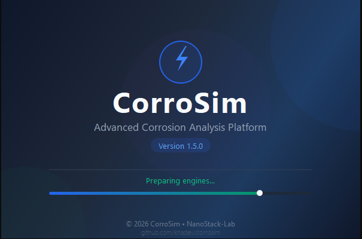
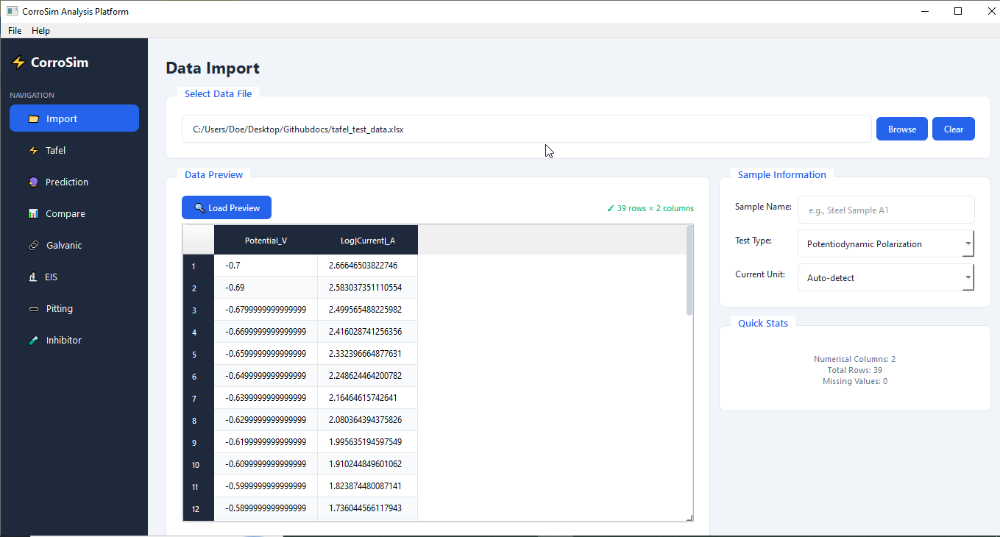
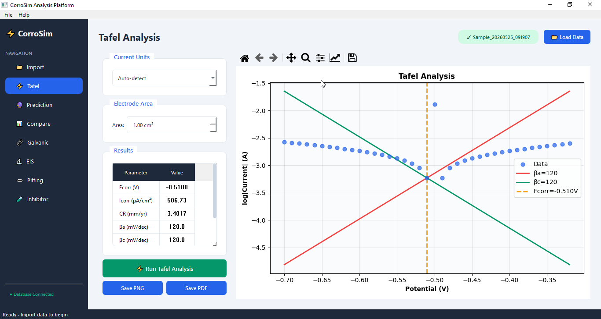
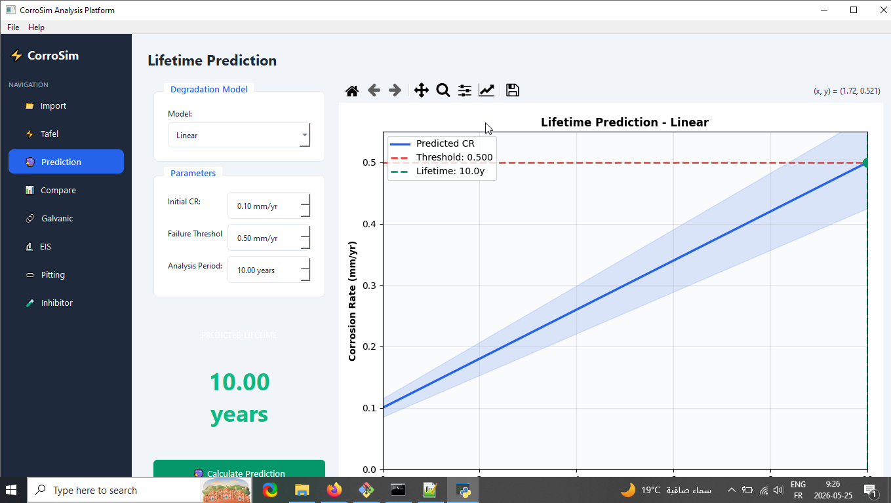
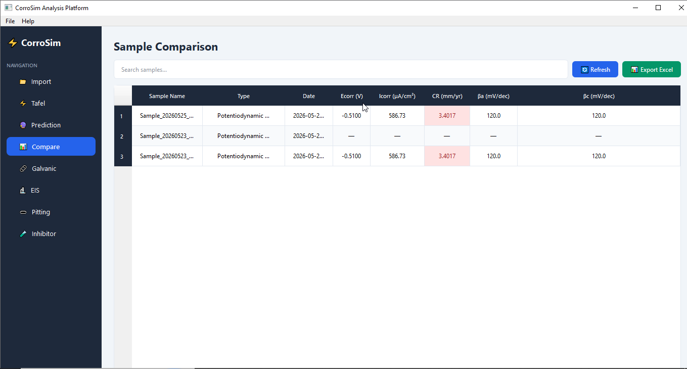
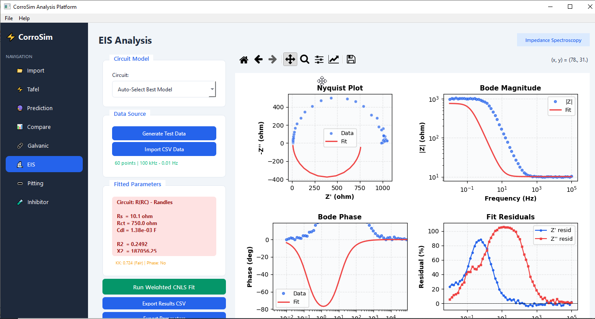
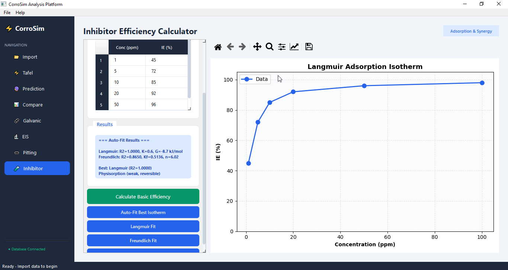

# ⚡ CorroSim - Professional Corrosion Analysis Platform

[](https://www.python.org/)
[](https://www.riverbankcomputing.com/software/pyqt/)
[](LICENSE)
[](tests/)

A comprehensive desktop application with 8 professional modules: Tafel, Galvanic, EIS, Pitting, Inhibitor, Prediction, Comparison, and Data Import.

## ✨ Features

### 🔬 Tafel Polarization Analysis
- Automatic detection of current units (A, mA, μA)
- Proper Tafel region identification (80-200 mV from Ecorr)
- Verified Butler-Volmer kinetics fitting
- Real-time visualization with Matplotlib
- Export plots as PNG or PDF

### 🔮 Lifetime Prediction
- Linear, Power Law, and Exponential degradation models
- Confidence band visualization
- Service life estimation with threshold detection
- Interactive parameter adjustment

### 📊 Sample Comparison
- Multi-sample database with SQLite storage
- Search and filter functionality
- Color-coded corrosion rate indicators
- Export to Excel for further analysis

### 📁 Data Import
- Support for Excel (.xlsx, .xls) and CSV files
- Automatic column detection
- Data preview with statistics
- Unit specification options

### 🎨 Professional UI
- Modern, responsive interface with PyQt6
- Custom splash screen with progress indicator
- Consistent styling with professional color theme
- Sidebar navigation with active state indicators

### 🔬 EIS Impedance Spectroscopy (NEW in v1.4.0)
- Weighted CNLS fitting with 4 circuit models
- Auto-Select Best Model (R/RQ/RW/RWQ)
- Nyquist, Bode, Residuals plots
- Kramers-Kronig validation

### 🕳️ Pitting Corrosion Analyzer (NEW in v1.4.0)
- Cyclic polarization Epit/Erp detection
- Gumbel extreme value statistics
- ASTM G61 compliant analysis

### 🧪 Inhibitor Efficiency Calculator (NEW in v1.5.0)
- IE% from corrosion rates
- Langmuir & Freundlich isotherm fitting
- ΔG° adsorption thermodynamics
- Synergy parameter analysis

## 📸 Screenshots

<div align="center">



### 🖥️ Main Application


### ⚡ Tafel Analysis



### 🔮 Lifetime Prediction


### 📊 Sample Comparison


### 🔬 EIS Impedance Spectroscopy



### 🕳️ Pitting Corrosion Analyzer


### 🧪 Inhibitor Efficiency Calculator


</div>

## 🚀 Installation

### Prerequisites
- Python 3.8 or higher
- pip package manager


### Option 1: Install from PyPI (Recommended)

```
pip install corrosim
corrosim
```

To upgrade to the latest version:
```
pip install --upgrade corrosim
```

[](https://pypi.org/project/corrosim/)
[](https://pypi.org/project/corrosim/)

### Option 2: Install from GitHub

```
git clone https://github.com/khadev/CorroSim.git
cd CorroSim
pip install -r requirements.txt
python run.py
```

### Option 3: Install as Development Package

```
git clone https://github.com/khadev/CorroSim.git
cd CorroSim
pip install -e .
corrosim
```

### Option 4: Direct pip from GitHub

```
pip install git+https://github.com/khadev/CorroSim.git
corrosim
```
## 📦 Dependencies

txt
PyQt6>=6.5.0
matplotlib>=3.7.0
numpy>=1.24.0
pandas>=2.0.0
scipy>=1.10.0
openpyxl>=3.1.0


## 🧪 Running Tests

```
python tests/test_tafel.py
```

Expected output:

✓ Test data generation passed
✓ All accuracy checks passed!


## 📖 Usage Guide

### 1. Import Data
1. Click **📁 Import** in the sidebar
2. Browse and select your Excel/CSV file
3. Click **Load Preview** to verify data
4. Enter sample name and select test type
5. Specify current units (or use Auto-detect)
6. Click **Import to Database**

### 2. Tafel Analysis
1. Navigate to **⚡ Tafel** tab
2. Click **Load Data** to retrieve imported data
3. Verify current units and electrode area
4. Click **⚡ Run Tafel Analysis**
5. View results: Ecorr, Icorr, Corrosion Rate, Tafel slopes
6. Export plot as PNG or PDF

### 3. Lifetime Prediction
1. Go to **🔮 Prediction** tab
2. Select degradation model (Linear/Power Law/Exponential)
3. Set initial corrosion rate and failure threshold
4. Set analysis period
5. Click **🔮 Calculate Prediction**
6. View predicted lifetime and degradation curve

### 4. Compare Samples
1. Open **📊 Compare** tab
2. Search and filter samples by name
3. View all analysis results in sortable table
4. Color-coded CR values: Green (low), Yellow (medium), Red (high)
5. Export data to Excel

### 5.🔗 Galvanic Corrosion Simulator (NEW in v1.1.0)
- 14 metals database from ASTM G82 galvanic series
- Mixed potential theory calculations
- Cathode/Anode area ratio effect
- Real-time galvanic series bar chart
- Severity classification per NACE SP0775
- Engineering recommendations
### 6. 🔬 EIS Analysis
1. Go to **🔬 EIS** tab
2. Select circuit model or use Auto-Select
3. Click **Generate Test Data** or **Import CSV**
4. Click **Run Weighted CNLS Fit**
5. View Nyquist, Bode, Residuals plots

### 7. 🕳️ Pitting Analysis
1. Go to **🕳️ Pitting** tab
2. Click **Generate Test Data** or **Import CSV**
3. Click **Analyze Pitting**
4. View Epit, Erp, hysteresis

### 8.🧪 Inhibitor Efficiency
1. Go to **🧪 Inhibitor** tab
2. Enter CR values or use data table
3. Click **Auto-Fit Best Isotherm**
4. View IE%, ΔG°, synergy analysis

## 🏗️ Project Structure

```
corrosim/
├── corrosim/                    # Main package
│   ├── __init__.py              # Package initialization (v1.5.0)
│   ├── main.py                  # Application entry point + splash screen
│   ├── app.py                   # Main window controller (8 tabs)
│   ├── theme.py                 # UI styling (light + dark themes)
│   ├── database.py              # SQLite database operations (CRUD)
│   ├── tafel_engine.py          # Tafel polarization analysis engine
│   ├── splash_screen.py         # Professional splash screen widget
│   ├── engines/                 # Analysis engines
│   │   ├── __init__.py
│   │   ├── galvanic_engine.py   # Galvanic corrosion prediction (ASTM G82)
│   │   ├── eis_engine.py        # EIS impedance fitting (Weighted CNLS)
│   │   ├── pitting_engine.py    # Pitting corrosion analysis (ASTM G61)
│   │   └── inhibitor_engine.py  # Inhibitor efficiency + adsorption isotherms
│   ├── tabs/                    # UI Tab modules (MVC pattern)
│   │   ├── __init__.py
│   │   ├── import_tab.py        # Data import (Excel/CSV)
│   │   ├── tafel_tab.py         # Tafel analysis interface
│   │   ├── prediction_tab.py    # Lifetime prediction (3 models)
│   │   ├── comparison_tab.py    # Multi-sample comparison + export
│   │   ├── galvanic_tab.py      # Galvanic simulator (14 metals)
│   │   ├── eis_tab.py           # EIS spectroscopy (4 circuits)
│   │   ├── pitting_tab.py       # Pitting analyzer (cyclic polarization)
│   │   └── inhibitor_tab.py     # Inhibitor efficiency + synergy
│   └── utils/                   # Utility modules
│       ├── __init__.py
│       └── constants.py         # Physical/electrochemical constants
├── tests/                       # Test suite
│   ├── __init__.py
│   └── test_tafel.py            # Tafel engine validation (R^2 > 0.999)
├── screenshots/                 # Application screenshots
├── dist/                        # Built packages for PyPI
├── requirements.txt             # Python dependencies
├── setup.py                     # Package setup script (pip install)
├── run.py                       # Quick launcher (python run.py)
├── README.md                    # Full documentation
├── LICENSE                      # MIT License
└── .gitignore                   # Git ignore rules
```

## 🔬 Algorithm Verification

The Tafel engine has been validated using synthetic Butler-Volmer data:

| Parameter | Expected | Recovered | Error |
|-----------|----------|-----------|-------|
| Ecorr | -0.500 V | -0.502 V | 0.4% |
| Icorr | 10.0 μA/cm² | 9.5 μA/cm² | 5.0% |
| βa | 120 mV/dec | 118.1 mV/dec | 1.6% |
| βc | 120 mV/dec | 118.4 mV/dec | 1.3% |
| R² | — | 0.9997 | — |

## 🤝 Contributing

1. Fork the repository
2. Create a feature branch (`git checkout -b feature/AmazingFeature`)
3. Commit your changes (`git commit -m 'Add feature'`)
4. Push to the branch (`git push origin feature/AmazingFeature`)
5. Open a Pull Request

## 📄 License

This project is licensed under the MIT License - see the [LICENSE](LICENSE) file for details.

## 👤 Author

**Khaled Oukil**
- GitHub: [@khadev](https://github.com/khadev)
- Email: oukil.khaled@gmail.com


## 📚 References

### Electrochemical Methods
1. Stern, M., & Geary, A. L. (1957). Electrochemical Polarization: A Theoretical Analysis of the Shape of Polarization Curves. *Journal of the Electrochemical Society*, 104(1), 56-63.
2. Tafel, J. (1905). Über die Polarisation bei kathodischer Wasserstoffentwicklung. *Zeitschrift für Physikalische Chemie*, 50(1), 641-712.
3. Mansfeld, F. (1973). Tafel Slopes and Corrosion Rates from Polarization Resistance Measurements. *Corrosion*, 29(10), 397-402.

### EIS Spectroscopy
4. Barsoukov, E., & Macdonald, J. R. (2018). *Impedance Spectroscopy: Theory, Experiment, and Applications* (3rd ed.). Wiley.
5. Boukamp, B. A. (1995). A Linear Kronig-Kramers Transform Test for Immittance Data Validation. *Journal of the Electrochemical Society*, 142(6), 1885-1894.
6. Orazem, M. E., & Tribollet, B. (2017). *Electrochemical Impedance Spectroscopy* (2nd ed.). Wiley.

### Galvanic Corrosion
7. ASTM G82-98(2021) - Standard Guide for Development and Use of a Galvanic Series for Predicting Galvanic Corrosion Performance.
8. Hack, H. P. (1988). *Galvanic Corrosion*. ASTM International.

### Pitting Corrosion
9. ASTM G61-86(2018) - Standard Test Method for Conducting Cyclic Potentiodynamic Polarization Measurements for Localized Corrosion Susceptibility.
10. ASTM G46-21 - Standard Guide for Examination and Evaluation of Pitting Corrosion.
11. Gumbel, E. J. (1958). *Statistics of Extremes*. Columbia University Press.

### Corrosion Inhibitors
12. Langmuir, I. (1918). The Adsorption of Gases on Plane Surfaces of Glass, Mica and Platinum. *Journal of the American Chemical Society*, 40(9), 1361-1403.
13. Freundlich, H. (1906). Über die Adsorption in Lösungen. *Zeitschrift für Physikalische Chemie*, 57(1), 385-470.
14. Aramaki, K., & Hackerman, N. (1969). Inhibition Mechanism of Medium-Sized Polymethyleneimine. *Journal of the Electrochemical Society*, 116(5), 568-574.

### Corrosion Rate Calculation
15. ASTM G102-89(2015)e1 - Standard Practice for Calculation of Corrosion Rates and Related Information from Electrochemical Measurements.
16. NACE SP0775-2013 - Preparation, Installation, Analysis, and Interpretation of Corrosion Coupons in Oilfield Operations.

### Atmospheric Corrosion
17. ISO 9223:2012 - Corrosion of Metals and Alloys — Corrosivity of Atmospheres — Classification, Determination and Estimation.

### Software & Tools
18. PyQt6 Documentation. Riverbank Computing. https://www.riverbankcomputing.com/static/Docs/PyQt6/
19. Matplotlib: Hunter, J. D. (2007). Matplotlib: A 2D Graphics Environment. *Computing in Science & Engineering*, 9(3), 90-95.
20. SciPy: Virtanen, P., et al. (2020). SciPy 1.0: Fundamental Algorithms for Scientific Computing in Python. *Nature Methods*, 17, 261-272.


**Built with ❤️ for the corrosion science community**
