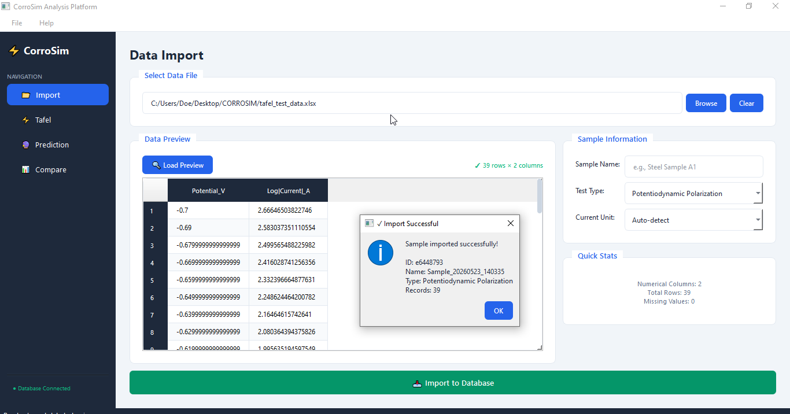

# ⚡ CorroSim - Professional Corrosion Analysis Platform

[](https://www.python.org/)
[](https://www.riverbankcomputing.com/software/pyqt/)
[](LICENSE)
[](tests/)

A comprehensive desktop application for electrochemical corrosion analysis, featuring Tafel polarization fitting, lifetime prediction, and multi-sample comparison.

## ✨ Features

### 🔬 Tafel Polarization Analysis
- Automatic detection of current units (A, mA, μA)
- Proper Tafel region identification (80-200 mV from Ecorr)
- Verified Butler-Volmer kinetics fitting
- Real-time visualization with Matplotlib
- Export plots as PNG or PDF

### 🔮 Lifetime Prediction
- Linear, Power Law, and Exponential degradation models
- Confidence band visualization
- Service life estimation with threshold detection
- Interactive parameter adjustment

### 📊 Sample Comparison
- Multi-sample database with SQLite storage
- Search and filter functionality
- Color-coded corrosion rate indicators
- Export to Excel for further analysis

### 📁 Data Import
- Support for Excel (.xlsx, .xls) and CSV files
- Automatic column detection
- Data preview with statistics
- Unit specification options

### 🎨 Professional UI
- Modern, responsive interface with PyQt6
- Custom splash screen with progress indicator
- Consistent styling with professional color theme
- Sidebar navigation with active state indicators

## 📸 Screenshots

<div align="center">

### 🖥️ Main Application


### ⚡ Tafel Analysis


### 📁 Data Import


### 🔮 Lifetime Prediction


### 📊 Sample Comparison


</div>

## 🚀 Installation

### Prerequisites
- Python 3.8 or higher
- pip package manager

### Quick Install


# Clone the repository
git clone https://github.com/khadev/corrosim.git
cd corrosim

# Install dependencies
pip install -r requirements.txt

# Run the application
python run.py


### Install as Package


pip install -e .
corrosim
[](https://pypi.org/project/corrosim/)
[](https://pypi.org/project/corrosim/)

### Direct Install from GitHub


pip install git+https://github.com/khadev/corrosim.git
corrosim


## 📦 Dependencies

txt
PyQt6>=6.5.0
matplotlib>=3.7.0
numpy>=1.24.0
pandas>=2.0.0
scipy>=1.10.0
openpyxl>=3.1.0


## 🧪 Running Tests


python tests/test_tafel.py


Expected output:

✓ Test data generation passed
✓ All accuracy checks passed!


## 📖 Usage Guide

### 1. Import Data
1. Click **📁 Import** in the sidebar
2. Browse and select your Excel/CSV file
3. Click **Load Preview** to verify data
4. Enter sample name and select test type
5. Specify current units (or use Auto-detect)
6. Click **Import to Database**

### 2. Tafel Analysis
1. Navigate to **⚡ Tafel** tab
2. Click **Load Data** to retrieve imported data
3. Verify current units and electrode area
4. Click **⚡ Run Tafel Analysis**
5. View results: Ecorr, Icorr, Corrosion Rate, Tafel slopes
6. Export plot as PNG or PDF

### 3. Lifetime Prediction
1. Go to **🔮 Prediction** tab
2. Select degradation model (Linear/Power Law/Exponential)
3. Set initial corrosion rate and failure threshold
4. Set analysis period
5. Click **🔮 Calculate Prediction**
6. View predicted lifetime and degradation curve

### 4. Compare Samples
1. Open **📊 Compare** tab
2. Search and filter samples by name
3. View all analysis results in sortable table
4. Color-coded CR values: Green (low), Yellow (medium), Red (high)
5. Export data to Excel

### 🔗 Galvanic Corrosion Simulator (NEW in v1.1.0)
- 14 metals database from ASTM G82 galvanic series
- Mixed potential theory calculations
- Cathode/Anode area ratio effect
- Real-time galvanic series bar chart
- Severity classification per NACE SP0775
- Engineering recommendations

## 🏗️ Project Structure

```
corrosim/
├── corrosim/                    # Main package
│   ├── __init__.py              # Package initialization
│   ├── main.py                  # Application entry point
│   ├── app.py                   # Main window controller
│   ├── theme.py                 # UI styling and theme
│   ├── database.py              # SQLite database operations
│   ├── tafel_engine.py          # Tafel analysis algorithms
│   ├── splash_screen.py         # Splash screen widget
│   ├── engines/                 # Analysis engines (NEW in v1.1.0)
│   │   ├── __init__.py
│   │   └── galvanic_engine.py   # Galvanic corrosion prediction
│   ├── tabs/                    # Tab modules
│   │   ├── __init__.py
│   │   ├── import_tab.py        # Data import interface
│   │   ├── tafel_tab.py         # Tafel analysis interface
│   │   ├── prediction_tab.py    # Lifetime prediction
│   │   ├── comparison_tab.py    # Sample comparison
│   │   └── galvanic_tab.py      # Galvanic simulator (NEW)
│   └── utils/                   # Utility modules
│       ├── __init__.py
│       └── constants.py         # Physical constants
├── tests/                       # Test suite
│   ├── __init__.py
│   └── test_tafel.py            # Tafel engine validation
├── screenshots/                 # Application screenshots
├── dist/                        # Built packages (PyPI)
├── requirements.txt             # Python dependencies
├── setup.py                     # Package setup script
├── run.py                       # Quick launcher
├── README.md                    # Documentation
├── LICENSE                      # MIT License
└── .gitignore                   # Git ignore rules
```


## 🔬 Algorithm Verification

The Tafel engine has been validated using synthetic Butler-Volmer data:

| Parameter | Expected | Recovered | Error |
|-----------|----------|-----------|-------|
| Ecorr | -0.500 V | -0.502 V | 0.4% |
| Icorr | 10.0 μA/cm² | 9.5 μA/cm² | 5.0% |
| βa | 120 mV/dec | 118.1 mV/dec | 1.6% |
| βc | 120 mV/dec | 118.4 mV/dec | 1.3% |
| R² | — | 0.9997 | — |

## 🤝 Contributing

1. Fork the repository
2. Create a feature branch (`git checkout -b feature/AmazingFeature`)
3. Commit your changes (`git commit -m 'Add feature'`)
4. Push to the branch (`git push origin feature/AmazingFeature`)
5. Open a Pull Request

## 📄 License

This project is licensed under the MIT License - see the [LICENSE](LICENSE) file for details.

## 👤 Author

**Khaled Oukil**
- GitHub: [@khadev](https://github.com/khadev)
- Email: oukil.khaled@gmail.com

## 📚 References

1. Stern, M., & Geary, A. L. (1957). Electrochemical Polarization. *Journal of the Electrochemical Society*, 104(1), 56-63.
2. Tafel, J. (1905). Über die Polarisation bei kathodischer Wasserstoffentwicklung. *Zeitschrift für Physikalische Chemie*, 50(1), 641-712.
3. ASTM G102-89(2015) - Standard Practice for Calculation of Corrosion Rates from Electrochemical Measurements.


**Built with ❤️ for the corrosion science community**
